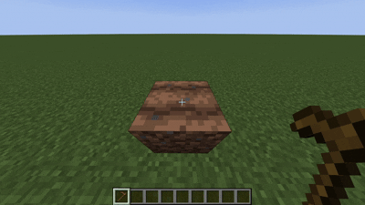
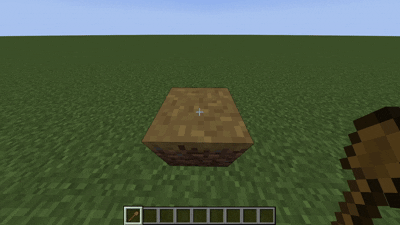
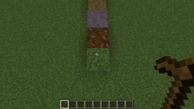
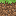
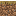
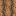
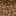
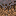
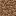
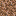

# Seltade's Tools

## Features

- Farmland can turn back into dirt.
  
  

- Dirt path can turn back into dirt.

  

- Dirt path can be created from grass block, podzol, mycelium, dirt path, coarse dirt and rooted dirt.
  
  

- Farmland can be created from grass block, podzol, mycelium, dirt path. As vanilla, coarse dirt and rooted dirt become dirt when using a hoe.

  

### With Seltade's Tools
||||
|---|---|---|
| ->|||
| ->|||
| ->|||
| ->|||
| ->|||
| ->|||
| ->|||
 ->|||

### Vanilla
||||
|---|---|---|
| ->|||
| ->||❌|
| ->||❌|
| ->|❌||
| ->|||
| ->|||
| ->|||
 ->|❌|❌|